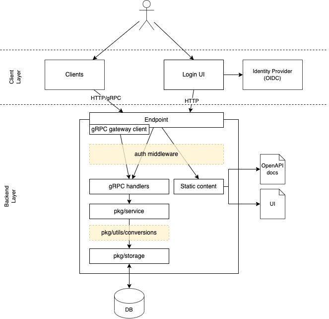
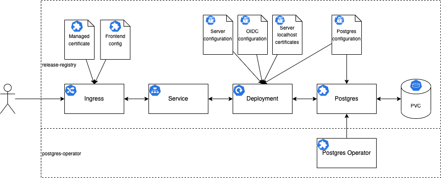

# Architecture

## GitHub tags vs custom service as backend

[ADR: A mechanism to mark, identify and search release artifacts using Quality Milestones](https://github.com/stackrox/architecture-decision-records/blob/main/releases/ADR-0001-a-mechanism-to-mark-identify-search-release-artifacts.md)

## Selection of frameworks and libraries

Criteria and the selected frameworks and libraries can be found [here](./frameworks.md).

## Type of persisted data storage

The database selection can be found [here](./frameworks.md#choice-of-database).

## Components

The client layer contains the clients, login UI and the identity provider.
The backend layer is comprised of the service, database and file system for static content.

The endpoint of the service accepts HTTP or gRPC requests, which are passed through the authentication middleware.
The handlers are implemented in the service package and interact with the storage layer.
Conversions between gRPC types and storage models are implemented in the conversions utils package.

## Deployment

The `release-registry` is deployed on GKE clusters through its Helm chart.
The `ManagedCertificate` and `FrontendConfig` resources are GKE specific.
The [Postgres Operator](https://github.com/CrunchyData/postgres-operator) needs to be deployed in the cluster to provision `PostgresCluster` resources.
