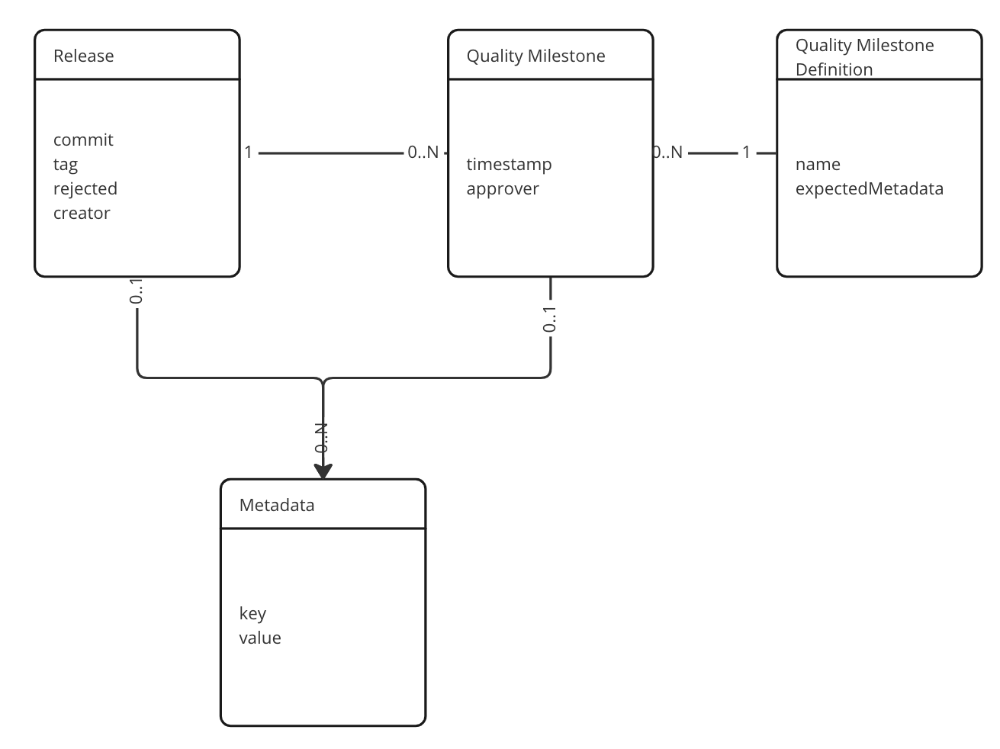
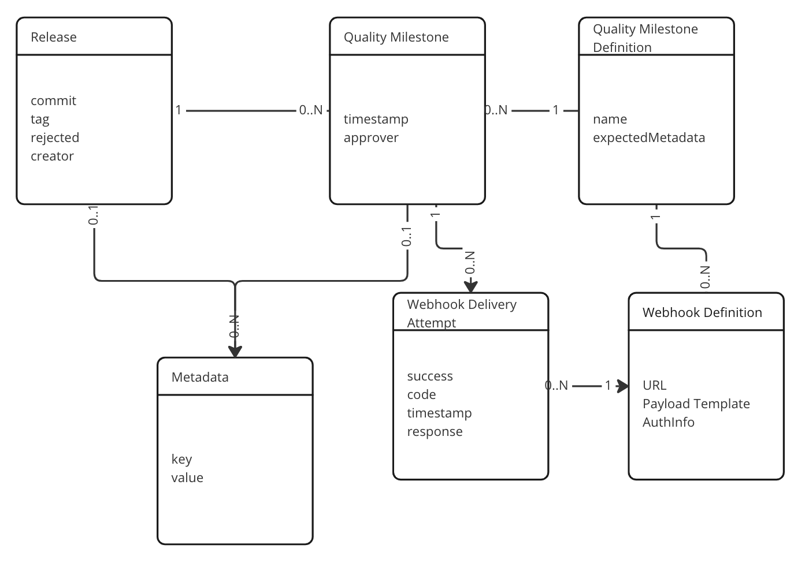

# Data model

## MVP

Based on the [Use cases](./use-cases.md) and required methods for the MVP, we have created a data model.

The service operator creates QualityMilestoneDefinitions to model the release process.

The nightly reviewer (or later a CI system) creates a Release.
The nightly reviewer (or later a CI system) approves a Release for a QualityMilestone, at which time a QualityMilestone object is created based on the QualityMilestoneDefinition, which was provided by name.

Users of the system can find Releases, their approved QualityMilestones and their associated information through joins on the Release, QualityMilestone and QualityMilestoneDefinition tables.

Releases and QualityMilestones both have Metadata attached to them to capture additional information in a more flexible format.
For example, Releases can track the name of the container images in Metadata, while Quality Milestones can keep URLs to build jobs.
QualityMilestoneDefinitions define the expected metadata keys for a QualityMilestone, which needs to be provided during approval.

The data model does not contain a ReleaseDefinition (similar to QualityMilestoneDefinition), because we do not expect multiple Release types to exist.
Outright rejecting a Release, e.g. because it was found to contain bugs after publication, is implemented through a field on a Release.
That enables filtering, so users can also find rejected Releases.

## MVP + Webhooks

Future versions of the release registry shall support webhooks that are triggered when a Quality Milestone has been reached/created.
That would enable the release registry to act as a process orchestrator.

The proposal for a data model including webhooks adds WebhookDefinitions attached to QualityMilestoneDefinitions and WebhookDeliveryAttempts bound to the QualityMilestone.
A separate process / thread / Go routine may be used to deliver webhooks from the WebhookDeliveryAttempts queue and update their status.
The implementation will have to answer additional questions with regards to the error handling:

- Use of atomic transactions for triggering webhooks
- Depending on required robustness of service: use of event queue, webhook table w/ pending jobs, etc..

## Other decisions

### Do we need a User / Account / Role Management?

- Decision: We want to implement OIDC for AuthNZ with Red Hat SSO.
- What does that mean for the MVP and its data model?
  - There is no need to include user or role management in the MVP. Distinguishing between authenticated and anonymous users is sufficient.
- What does that mean for future versions?
  - For future versions, we can consider implementing a role management with roles like Admin, Content Editor (editing QualityMilestoneDefinitions), Approver, Release Creator, Viewer.
  - In the spirit of open culture and because we do not plan to have multi-tenancy support, the data model and backend for user and role management in future versions can be developed independently of the core release functionality.

### For future versions

- Move a release to a previous QM. For example, automation or human error approved a QM that has not yet been reached.
  - Implement this by deleting the QM. If webhooks are implemented, abort any pending.
- Chaining of Quality Milestone Definitions to model the release process
  - Out of scope for MVP because implements only a single QM.
  - Can be implemented by `next` and `previous` fields in the Quality Milestone Definitions.
    - That would enable sanity checks for order of Quality Milestones (cannot approve QM2 before QM1 has been approved)

### Other considerations

- Break glass process to create a release at a Quality Milestone, skipping webhooks
  - out of MVP scope to have separate endpoints for this
- ORM framework should support:
  - pagination
  - migration
- Updates to Quality Milestone definition
  - Migration shall be handled by ORM framework, existing QMs will have empty values for the new values.
  - Additional or removed ExpectedMetadataKeys affect only new Quality Milestones. The client is expected to handle missing values.
  - Changing the name attribute of a Quality Milestone Definition can be supported by introduction of an aliases field, if backward compatibility is desired.
